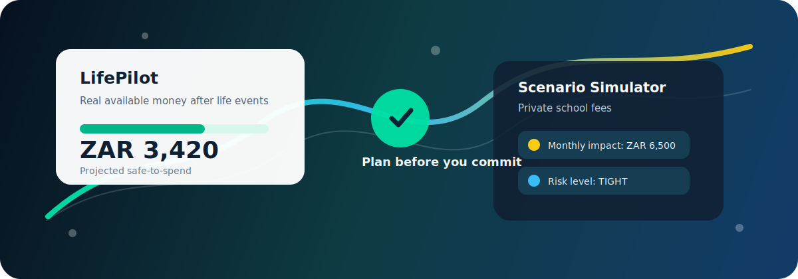

<p align="center">
  
</p>

<h1 align="center">LifePilot</h1>

<p align="center">
  <strong>See the financial impact of a life decision before you make it.</strong>
</p>

<p align="center">
  
  
  
  
  
</p>

<p align="center">
  <a href="#what-it-is">What it is</a> |
  <a href="#what-works-now">What works now</a> |
  <a href="#simulator-and-add-ons">Simulator and add-ons</a> |
  <a href="#api">API</a> |
  <a href="#run-it">Run it</a>
</p>

---

## What It Is

**LifePilot** is a simulator-first app built on Investec account data.

The main product idea is simple:

> "What happens to my monthly position if I make this life decision?"

Instead of stopping at balances and transactions, LifePilot is designed to simulate decisions like private school, a second car, a renovation, unpaid leave, or a big purchase before the user commits.

The AI pieces are there to support that simulator, not replace it. They help explain the numbers, ground answers in stored guidance, and make the experience more helpful.

## What Works Now

| Capability | Status | Notes |
| --- | --- | --- |
| Live Investec API auth | Built | Uses OAuth2 client credentials and API key |
| Accounts, balances, transactions | Built | Reads account data from Investec endpoints |
| Safe-to-spend calculation | Built | Deterministic budgeting logic |
| Budget risk classification | Built | `HEALTHY`, `TIGHT`, `CRITICAL` |
| Life event scenario simulator | Built | Projects monthly impact and recommendations |
| AI coach endpoints | Built | Account-aware coaching answers |
| Knowledge search endpoints | Built | Lightweight retrieval layer |
| Guardrail checks | Built | Rewrites risky financial wording into safer educational guidance |
| Evaluation scenarios | Built | Default evaluation prompts and criteria |
| Frontend simulator | Built | User-facing scenario setup and results |

## Simulator And Add-ons

LifePilot should remain centered on the simulator.

### Core simulator

The core experience is:

- start with a real account
- estimate existing monthly commitments
- simulate a life event
- see the projected safe-to-spend impact
- get educational recommendations

### Add-ons around the simulator

These features support the simulator and make the product smarter:

- `AI Coach`
  Explains affordability and spending pressure in plainer language using deterministic calculations plus available knowledge.

- `Knowledge`
  Stores financial guidance documents that can be searched and used to ground AI responses.

- `Evaluations`
  Checks whether AI answers stay grounded, safe, and aligned with the budgeting logic.

## Example Simulator Response

```json
{
  "accountId": "account-id",
  "scenarioType": "PRIVATE_SCHOOL",
  "scenarioName": "Send child to private school",
  "availableBalance": 8764.11,
  "currentSafeToSpend": -8435.89,
  "projectedSafeToSpend": -14935.89,
  "monthlyImpact": 6500.00,
  "onceOffImpact": 15000.00,
  "durationMonths": 18,
  "currency": "ZAR",
  "riskLevel": "CRITICAL",
  "summary": "This life event would reduce your monthly safe-to-spend by ZAR 6500.00, leaving a projected safe-to-spend amount of ZAR -14935.89.",
  "recommendations": [
    "Delay this scenario until your current safe-to-spend is positive.",
    "Reduce existing monthly commitments before adding this cost.",
    "Build a separate buffer for the once-off cost before committing."
  ],
  "disclaimer": "Educational planning guidance only. This is not financial advice."
}
```

## API

### Investec Support Endpoints

```text
GET /api/investec/config-check
GET /api/investec/token-check
GET /api/investec/accounts
GET /api/investec/accounts/{accountId}/balance
GET /api/investec/accounts/{accountId}/transactions?fromDate=YYYY-MM-DD&toDate=YYYY-MM-DD
```

### Money Coach Endpoints

```text
GET /api/coach/accounts/{accountId}/safe-to-spend
GET /api/coach/accounts/{accountId}/advice
```

### LifePilot Simulator Endpoint

```text
POST /api/lifepilot/scenarios
```

### LifePilot Add-on Endpoints

```text
GET  /api/lifepilot/knowledge/documents
POST /api/lifepilot/knowledge/documents
POST /api/lifepilot/knowledge/search
POST /api/lifepilot/safe-to-spend/accounts/{accountId}/advanced
POST /api/lifepilot/ai-coach/accounts/{accountId}/ask
POST /api/lifepilot/guardrails/check
GET  /api/lifepilot/evaluations/default
```

## Run It

### Requirements

- Java 17
- Maven 3.9+ or the included Maven wrapper

### Required environment variables

```text
INVESTEC_CLIENT_ID
INVESTEC_CLIENT_SECRET
INVESTEC_API_KEY
```

### Optional OpenAI environment variables

```text
OPENAI_API_KEY
OPENAI_MODEL
```

### Start the backend

```powershell
.\mvnw.cmd spring-boot:run
```

Default URL:

```text
http://localhost:8080
```

### Run tests

```powershell
.\mvnw.cmd test
```

## Safety Notes

LifePilot works with live banking data when configured with real Investec credentials.

- Do not commit API keys, secrets, tokens, private certificates, or real customer data.
- Prefer sandbox credentials for demos and public screenshots.
- Treat all balances, account IDs, and transactions as sensitive.
- Guidance must remain educational and must not be presented as regulated financial advice.

## Disclaimer

LifePilot provides educational budgeting and planning guidance only. It does not provide regulated financial advice and does not make financial decisions on behalf of users.
