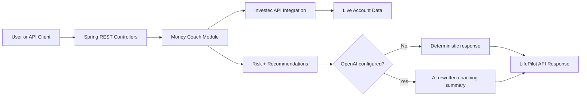
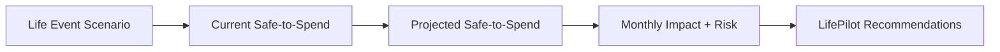

<p align="center">
  
</p>

<h1 align="center">LifePilot</h1>

<p align="center">
  <strong>See the financial impact of a life decision before you make it.</strong>
</p>

<p align="center">
  
  
  
  
  
</p>

<p align="center">
  <a href="#what-it-is">What it is</a> |
  <a href="#what-works-now">What works now</a> |
  <a href="#api">API</a> |
  <a href="#architecture">Architecture</a> |
  <a href="#run-it">Run it</a>
</p>

---

## What It Is

**LifePilot** is a Spring Boot backend MVP that turns live Investec account data into practical life-planning insight.

Most banking apps show a balance. LifePilot is designed to answer the harder question:

> "Can my real life afford this decision?"

The current codebase already contains the internal **Money Coach** module, which calculates safe-to-spend money, classifies budget risk, and returns educational recommendations. The next product layer is the LifePilot scenario simulator: "What happens if I buy a second car, send my child to private school, move city, take unpaid leave, or start a side business?"

## The Product Idea

| Life decision | What LifePilot should simulate |
| --- | --- |
| Private school | Monthly fee impact, safe-to-spend drop, survival budget |
| New house or bond | Higher repayment impact, buffer risk, goal trade-offs |
| New baby | Once-off costs, recurring costs, emergency fund pressure |
| Career change | Income gap, runway, spending reductions |
| Overseas holiday | Monthly savings target, timeline, affordability risk |

## What Works Now

| Capability | Status | Notes |
| --- | --- | --- |
| Live Investec API auth | Built | Uses OAuth2 client credentials and API key |
| Accounts, balances, transactions | Built | Reads account data from Investec endpoints |
| Safe-to-spend calculation | Built | `availableBalance - estimatedBills - goalSavingAmount` |
| Budget risk classification | Built | `HEALTHY`, `TIGHT`, `CRITICAL` |
| Recommendations | Built | Deterministic educational guidance |
| OpenAI rewrite layer | Optional | Rewrites deterministic advice when configured |
| Life event scenario simulator | Planned | Next major feature |

## Example Insight

```json
{
  "availableBalance": 8764.11,
  "estimatedBills": 16700.00,
  "goalSavingAmount": 500.00,
  "safeToSpend": -8435.89,
  "currency": "ZAR",
  "riskLevel": "CRITICAL",
  "summary": "You are short by ZAR 8435.89 after protecting estimated bills of ZAR 16700.00 and goal savings of ZAR 500.00.",
  "recommendations": [
    "Reduce or delay non-essential spending until your bills and savings target are covered.",
    "Review bill estimates and adjust the savings target if the shortfall is temporary.",
    "Avoid new discretionary commitments until your safe-to-spend amount is positive."
  ],
  "aiGenerated": false,
  "disclaimer": "Educational budgeting guidance only. This is not financial advice."
}
```

## API

### Investec Support Endpoints

```text
GET /api/investec/config-check
GET /api/investec/token-check
GET /api/investec/accounts
GET /api/investec/accounts/{accountId}/balance
GET /api/investec/accounts/{accountId}/transactions?fromDate=YYYY-MM-DD&toDate=YYYY-MM-DD
```

### Money Coach Module

```text
GET /api/coach/accounts/{accountId}/safe-to-spend
GET /api/coach/accounts/{accountId}/advice
```

Example:

```text
GET /api/coach/accounts/{accountId}/advice?bondOrRent=15000&schoolFees=3000&insurance=2000&groceries=6000&fuel=3000&subscriptions=1000&otherBills=2000&goalSavingAmount=500
```

### Planned LifePilot Scenario Endpoint

```text
POST /api/lifepilot/scenarios
```

Planned request shape:

```json
{
  "accountId": "account-id",
  "scenarioType": "PRIVATE_SCHOOL",
  "scenarioName": "Send child to private school",
  "monthlyCost": 6500,
  "onceOffCost": 15000,
  "durationMonths": 18
}
```

## Architecture



Planned LifePilot layer:



## Configuration

Required environment variables:

```text
INVESTEC_CLIENT_ID
INVESTEC_CLIENT_SECRET
INVESTEC_API_KEY
```

Optional OpenAI environment variables:

```text
OPENAI_API_KEY
OPENAI_MODEL
```

If OpenAI is not configured, the advice endpoint still returns deterministic recommendations.

## Run It

Start the backend:

```powershell
.\mvnw.cmd spring-boot:run
```

Default URL:

```text
http://localhost:8080
```

Run tests:

```powershell
.\mvnw.cmd test
```

## Tech Stack

| Layer | Technology |
| --- | --- |
| Language | Java 17 |
| Backend | Spring Boot 4.0.6 |
| Build | Maven |
| Banking integration | Investec Open API |
| AI layer | Optional OpenAI Responses API |
| Tests | JUnit 5 / Spring Boot test |

## Showcase Positioning

**One-line tagline:**

> LifePilot uses live Investec account data to show the financial impact of major life decisions before users commit to them.

**Community categories:**

- Budgeting and personal finance
- Automations and savings
- AI and categorisation
- Financial wellness

## Safety Notes

LifePilot works with live banking data when configured with real Investec credentials.

- Do not commit API keys, secrets, tokens, private certificates, or real customer data.
- Prefer sandbox credentials for demos and public screenshots.
- Treat all balances, account IDs, and transactions as sensitive.
- Generated guidance must stay educational and must not be presented as regulated financial advice.

## Disclaimer

LifePilot provides educational budgeting and planning guidance only. It does not provide regulated financial advice and does not make financial decisions on behalf of users.

## Author

**Randall Erasmus**

GitHub: [github.com/randallerasmus](https://github.com/randallerasmus)
