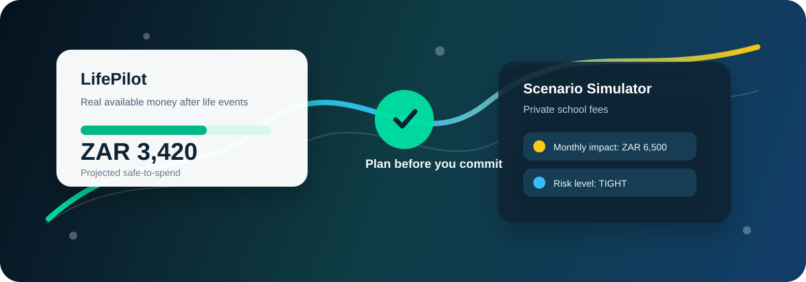

<p align="center">
  
</p>

<h1 align="center">LifePilot</h1>

<p align="center">
  <strong>Your balance tells you what happened. LifePilot tells you what happens next.</strong>
</p>

<p align="center">
  
  
  
  
  
</p>

<p align="center">
  <a href="#future-you-in-one-minute">Future You in one minute</a> |
  <a href="#try-it-in-two-minutes-no-investec-credentials">Try it</a> |
  <a href="#how-it-works">How it works</a> |
  <a href="#api">API</a> |
  <a href="#known-gaps">Known gaps</a>
</p>

---

Built for the Investec **Future You** Q3 2026 bounty. The brief asks for a tool that
forecasts future balances, spots recurring payments, highlights upcoming cashflow
risks, or answers "can I afford this?". LifePilot does all four, on the Investec
Account Information API and a Programmable Card.

## Future You In One Minute

The demo account has **R35,196** available today. The card thinks you can spend all of it.

LifePilot reads six months of transactions and finds that the money is already
spoken for:

- **Recurring payments spotted:** bond R12,500, vehicle finance R4,200, school fees
  R3,500, medical aid R2,100, car insurance R899, gym R499, Netflix R199 and Spotify
  R79. It also finds the salary: R39,000 on the 25th.
- **Balance forecast:** the balance is projected day by day for 90 days, with each
  debit order on its own due date and day-to-day spending averaged in between.
- **Cashflow risk:** *"Projected balance goes below zero on 2026-10-21 and stays
  negative for 4 day(s), reaching -479.76 on 2026-10-24. That is 21 day(s) from now."*
  The same squeeze comes back in November.
- **Can I afford this?** A R12,000 laptop at the till is checked against the
  **R10,720** that is actually free before payday, not the R35,196 balance:

  > 12000.00 exceeds the 10720.00 free to spend before income lands on 2026-10-25
  > by 1280.00. The balance of 35196.00 is already committed to 23976.00 of
  > upcoming debits.

  A R12,000 fuel purchase on the same card goes straight through. Fuel, groceries,
  transport, pharmacy, medical and utilities are never declined.

*Figures are real output from the demo account on 30 September 2026. The demo
history is generated relative to today, so your numbers will differ.*

## What It Does

| Bounty ask | LifePilot | Where |
| --- | --- | --- |
| Forecast future balances | Day-by-day projection up to 365 days, with opening, inflow, outflow and closing balance for every day | `BalanceForecastService` |
| Spot recurring payments | Detects debit orders, subscriptions and salary by merchant, cadence and amount stability, and scores each one's confidence | `RecurringPaymentDetector` |
| Highlight cashflow risks | Groups the at-risk days into dated windows marked `TIGHT` (below your threshold) or `CRITICAL` (overdrawn) | `BalanceForecastService` |
| Can I afford this? | **At the till:** the Programmable Card checks each swipe against money that is free before payday. **Before a big decision:** the life-event simulator | `card/`, `CardAuthorizationService`, `LifePilotScenarioService` |

Around that core:

- An AI coach that answers questions about the account. It only explains figures
  the deterministic layer already calculated, and it never invents numbers.
- A knowledge base for grounding the coach's answers.
- Guardrails that rewrite anything that reads like regulated financial advice.

Every calculation is deterministic and unit-tested. AI is optional.

## Try It In Two Minutes (No Investec Credentials)

A built-in demo account (`demo-account`) generates six months of realistic history,
so every feature works without Investec credentials.

**1. Start the backend** (Java 17+):

```powershell
$env:LIFEPILOT_CARD_SHARED_SECRET = "any-local-secret"
.\mvnw.cmd spring-boot:run
```

```bash
LIFEPILOT_CARD_SHARED_SECRET=any-local-secret ./mvnw spring-boot:run
```

**2. Forecast the balance:**

```bash
curl "http://localhost:8080/api/lifepilot/accounts/demo-account/forecast?horizonDays=90&minimumBalanceThreshold=1000"
```

**3. Ask the card whether a purchase is affordable:**

```bash
# Build the snapshot the card reads from. After this, it is kept fresh automatically.
curl -X POST -H "X-LifePilot-Card-Key: any-local-secret" \
  http://localhost:8080/api/lifepilot/cards/accounts/demo-account/snapshot

# A R12,000 laptop
curl -X POST -H "Content-Type: application/json" \
  -H "X-LifePilot-Card-Key: any-local-secret" \
  -d '{"accountId":"demo-account","centsAmount":1200000,"currencyCode":"ZAR","merchantName":"Incredible Connection","merchantCategoryCode":"5732"}' \
  http://localhost:8080/api/lifepilot/cards/authorization
```

The laptop comes back as `EXCEEDS_HEADROOM` with `decision: APPROVE`. The card runs
in monitor mode by default: it records the verdict but does not act on it. Change
`merchantCategoryCode` to `5541` (fuel) and it comes back as `ESSENTIAL_CATEGORY`.

**4. See it visually.** Run the
[`lifepilot-frontend`](https://github.com/randallerasmus/lifepilot-frontend) and open
`http://localhost:8081/forecast` with account ID `demo-account`. It shows the
balance curve, shaded risk windows, and tables of the detected payments and income.

**Run the tests:**

```powershell
.\mvnw.cmd test
```

## How It Works

### Recurring payment detection

Transactions are grouped by a normalised merchant key, so that `NETFLIX.COM 4392`
and `Netflix.com 8811` count as the same merchant. A group is accepted as recurring
only when:

- it appears at least twice;
- the gap between payments matches a known cadence (weekly, fortnightly, monthly
  and so on);
- no amount is more than 25% away from the median.

Each accepted group gets a confidence score based on how often it appeared, how
evenly spaced the payments were, and how stable the amount was. A payment not
seen for two of its own cycles counts as cancelled, so the forecast stops charging
for it. The same rules find recurring income such as salary.

### Balance forecast

Starting from today's available balance:

- every recurring debit and credit is placed on its own future due dates;
- everything else in the history is averaged into a daily discretionary spend,
  with recurring amounts removed first so they are not counted twice.

The walk from day to day produces a closing balance per day. Consecutive days
below your threshold become one dated risk window. Each response lists the
assumptions it made, such as the history window used, the number of payments
detected, and whether income was detected or supplied.

### "Can I afford this?" at the till

Investec's `beforeTransaction` hook has **two seconds**, including the network
round trip. A forecast takes several seconds, so the card never computes one:

| When | What runs |
| --- | --- |
| `beforeTransaction` (2s) | One POST. The backend answers from a cached snapshot in milliseconds, without calling any other service. |
| `afterTransaction` / `afterDecline` (15s) | Rebuilds the snapshot so the next swipe sees the spend that just happened. |
| Every 4 minutes | The backend rebuilds the snapshot of every account the card has used, so a swipe hours after the last one still gets a real answer. |

The snapshot reduces the forecast to one number, the **discretionary headroom**:
the balance, minus the recurring debits due before the next payday, minus an
emergency buffer.

The guardrail is built to fail safe:

- **Uncertain means approve.** A missing, stale or fallback snapshot, a timeout,
  an HTTP error or an unreadable response all approve the transaction. Only an
  explicit `DECLINE` stops a transaction.
- **Essentials are never declined.** This covers groceries, fuel, transport,
  pharmacy, medical and utilities.
- **Monitor mode is on by default.** Watch the verdicts against real spending,
  then set `LIFEPILOT_CARD_MONITOR_ONLY=false` to let it decline.
- **A failed rebuild never replaces a good snapshot.** If Investec is unreachable
  during a rebuild, the last good snapshot is kept until it expires. It is never
  swapped for one that reads a zero balance.

Setup for a real card is in [`card/README.md`](card/README.md).

### Life-event simulator

`POST /api/lifepilot/scenarios` answers bigger questions, such as private school, a
second car, a renovation or unpaid leave. It returns the monthly impact, an
`AFFORDABLE` / `TIGHT` / `UNAFFORDABLE` status, and educational recommendations.

## API

### Future You: forecast and card

```text
GET  /api/lifepilot/accounts/{accountId}/forecast?horizonDays=&minimumBalanceThreshold=&expectedMonthlyIncome=&nextIncomeDate=&includeDiscretionarySpend=
POST /api/lifepilot/accounts/{accountId}/forecast
POST /api/lifepilot/cards/authorization                        (X-LifePilot-Card-Key)
POST /api/lifepilot/cards/accounts/{accountId}/snapshot        (X-LifePilot-Card-Key)
```

### Simulator and coaching

```text
POST /api/lifepilot/scenarios
GET  /api/coach/accounts/{accountId}/safe-to-spend
GET  /api/coach/accounts/{accountId}/advice
POST /api/lifepilot/safe-to-spend/accounts/{accountId}/advanced
POST /api/lifepilot/ai-coach/accounts/{accountId}/ask
GET  /api/lifepilot/knowledge/documents
POST /api/lifepilot/knowledge/documents
POST /api/lifepilot/knowledge/search
POST /api/lifepilot/guardrails/check
GET  /api/lifepilot/evaluations/default
```

### Investec passthrough

```text
GET /api/investec/config-check
GET /api/investec/token-check
GET /api/investec/accounts
GET /api/investec/accounts/{accountId}/balance
GET /api/investec/accounts/{accountId}/transactions?fromDate=YYYY-MM-DD&toDate=YYYY-MM-DD
```

## Configuration

| Variable | Default | Purpose |
| --- | --- | --- |
| `INVESTEC_CLIENT_ID`, `INVESTEC_CLIENT_SECRET`, `INVESTEC_API_KEY` | blank | Live Investec access. Not needed for `demo-account`. |
| `LIFEPILOT_DEMO_ENABLED` | `true` | Serves generated history for `demo-account`. Any other account ID still goes to Investec. |
| `LIFEPILOT_CARD_SHARED_SECRET` | blank | Required for the card endpoints. While it is blank they return `503`, because they face the internet and return balances. |
| `LIFEPILOT_CARD_MONITOR_ONLY` | `true` | Records the verdict without declining. |
| `LIFEPILOT_CARD_EMERGENCY_BUFFER` | `500.00` | Held back from headroom. |
| `LIFEPILOT_CARD_SNAPSHOT_TTL_SECONDS` | `900` | Oldest snapshot a swipe will trust. |
| `LIFEPILOT_CARD_SNAPSHOT_REFRESH_SECONDS` | `240` | How often snapshots of accounts the card has used are rebuilt. |
| `OPENAI_API_KEY`, `OPENAI_MODEL` | blank | Optional AI rewording of coach answers. |

## Known Gaps

These gaps are listed here on purpose, so an evaluator does not have to find them.

- **The simulator does not use the forecast yet.** Scenarios subtract a flat
  monthly cost from safe-to-spend. On the demo account, a R6,500/month private
  school scenario comes back `AFFORDABLE`, while the forecast shows the same
  account going overdrawn before payday. The next step is to rebuild scenarios on
  top of `BalanceForecastService`, so a life event redraws the day-by-day curve.
- **The card code has not been run inside the Investec card sandbox.** The hook
  names, the time windows and the authorisation fields come from the Investec docs
  and community repos. The backend side is covered by tests.
- **Snapshots are held in memory.** A restart empties the cache, and the first
  swipe after it approves while a new snapshot is built.
- **Single user.** One account per card, and a shared secret as the only
  authentication. That is enough for a personal prototype, but not for production.

## Safety

- Do not commit API keys, secrets, tokens or real banking data.
- Use `demo-account` or sandbox credentials for demos and screenshots.
- LifePilot provides educational budgeting and planning guidance only. It does
  not give regulated financial advice or make financial decisions for anyone.
